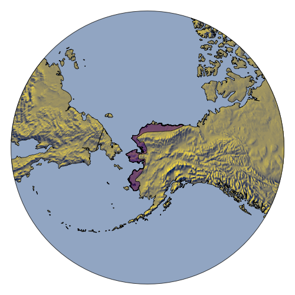

## Conklin, Lisovski & Battley 2021 - Environmental data and analysis

In Arctic-breeding shorebirds, timing of breeding closely follows the retreat of snow-cover from tundra nest sites in the spring. We compared two indices of breeding phenology (timing of
snowmelt and spring ‘green-up’), summarized separately for two regions (North, South) of the Alaska breeding range (Figure 1) of bar-tailed godwits. We did this for two temporal periods: long-term trends encompassing the entire study period (2008–2020), and a shorter term related directly to the period in which we tracked individuals with geolocators (2008–2014).

```{breedingRange, echo=FALSE, eval=FALSE, message=FALSE, warning=FALSE}
library(sf)
library(sp)
library(rnaturalearth)
library(raster)

set.seed(200)

btg   <- st_read("data/btg_breedingAK/btg_breedingSiteAK.shp") %>% st_set_crs(4326)
# rst <- ne_download(scale = "median", type = "MSR_50M", category = 'raster', destdir = "tmp")
rst   <- stack("tmp/MSR_50M/MSR_50M.tif")


center <- st_centroid(btg)
proj   <- sprintf("+proj=laea +lon_0=%f +lat_0=%f +ellps=sphere", st_coordinates(center)[,1], st_coordinates(center)[,2])
bfr    <- st_transform(center, proj) %>% st_buffer(2500*1000) %>% st_geometry()
# map  <- ne_download(scale = 50, type = "land", category = 'physical', destdir = "tmp")
map    <- st_read("tmp/ne_50m_land.shp", quiet = TRUE) %>% st_geometry() %>% st_transform(proj) %>% 
              st_buffer(0) %>% st_intersection(bfr) %>% st_difference(bfr)

rstPr  <- mask(crop(projectRaster(rst, crs = CRS(proj)), as(bfr, "Spatial")), as(map, "Spatial"), inverse = FALSE)

png("images/Fig01_breedingRange.png", width = 500, height = 500)
  opar <- par(mar = c(0,0,0,0), bty = "n")
  plot(bfr, col = "lightsteelblue3")
  plot(rstPr, col = viridis::cividis(100), legend = FALSE, add = T)
  plot(map, add = T)
  plot(btg %>% st_transform(proj) %>% st_geometry(), col = adjustcolor("purple4", alpha.f = 0.5), add = T)
  par(opar)
dev.off()
```
<center>
  </img>
  <figcaption>Figure 1: Breeding range of Bar-tailed godwits in Alaska. Map data from Natural Earth https://www.naturalearthdata.com/. Breeding range supplied by BirdLife International and Handbook of the Birds of the World (2017) Bird species distribution maps of the world. Version 7.0. Available at http://datazone.birdlife.org/species/requestdis</figcaption>
</center>

## The Datasets

### IMS Daily Northern Hemisphere Snow and Ice Analysis

Remotely sensed IMS Daily Northern Hemisphere Snow and Ice Analysis data for the period 2008–2020 on a scale of 4 x 4 km were downloaded from the National Snow & Ice Data Center [1].

1. List all available downloaded IMS scenes (paths to files) and extract dates.


```{snow1}
fls.gz <- list.files("/Volumes/bioing/user/slisovsk/4km", pattern = ".gz", recursive = T,  full.names = T) ## list all downloaded IMS ASCI files

## get dates for ASCI files
dates  <- as.Date(as.POSIXct(unlist(lapply(strsplit(fls.gz, "ims"), function(x) strsplit(x[[2]], "_4km")))[c(TRUE, FALSE)], format = "%Y%j"))
```   

2. Initialize the file structure (projection, raster indices)

```{snow2}
prj <- "+proj=stere +lat_0=90 +lat_ts=60 +lon_0=-80 +k=1 +x_0=0 +y_0=0 +a=6378137 +b=6356257 +units=m +no_defs"

## read random file to initialize raster
rastID  <- sample(1:length(fls.gz), 1)
asciDat <- readLines(fls.gz[rastID])
tab     <- asciDat[-which(unlist(suppressWarnings(lapply(tab0, function(x) is.na(as.numeric(gsub(" ", "", x)))))))] ## delete non-data
  
  z <- unlist(lapply(tab, function(.line) as.numeric(strsplit(.line, '')[[1]]))) ## snow data to vector
  m <- matrix(z, ncol = 6144, nrow = 6144, byrow = T)[6144:1,]                   ## to matrix (and flip)                         

  snowR <- raster(m, crs = CRS(prj))                                             ## to raster
  extent(snowR)      <- c(-12288000, 12288000, -12288000, 12288000)              ## define extent

## get raster indices for cells inside the breeding range  
rInd <- extract(snowR, as(btg %>% st_transform(prj), "Spatial"), cellnumbers=TRUE)[[1]][,1]
  
# png("images/Fig02_init.png", width = 2000, height = 1000)
#   opar <- par(mfrow = c(1,2), mar = c(0,0,0,0), bty = "n")
#   plot(snowR, legend = FALSE, breaks = seq(-1, 4), col = c("transparent", "lightsteelblue3", "palegreen4", "grey80", "grey99"),
#      xaxt = "n", yaxt = "n")
#   plot(btg %>% st_transform(prj) %>% st_geometry(), add = T, col = adjustcolor("purple4", alpha.f = 0.5), border = NA)
# 
#   plot(btg %>% st_transform(prj) %>% st_geometry())
#   points(coordinates(snowR)[rInd,], pch = 16, cex = 0.1)
#   par(opar)
# dev.off()
```

<center>
  </img>
  <figcaption>Figure 2: Random IMS scene (green = open land, white = snow covered land, grey = ice covered ocean) in the left and breeding range polygon with center coordinates of cells that intersect with the breeding range on the right (n = 13,442 cells).</figcaption>
</center>

3. Create matrix with each pixel that intersects the breeding range in rows and for each scene in columns. Change `mclapply` to `lapply` (and delete the `mc.cores` option) on systems running windows.

```{snow3, eval = false}
snowM <- do.call("cbind", parallel::mclapply(1:length(dates), function(x) {  
    
    tmp <- suppressWarnings(readLines(fls.gz[x]))
    ind  <- tmp[-which(unlist(suppressWarnings(lapply(tab0, function(x) is.na(as.numeric(gsub(" ", "", x)))))))]
    
    z <- unlist(lapply(tab, function(.line) as.numeric(strsplit(.line, '')[[1]])))
    m <- matrix(z, ncol = 6144, nrow = 6144, byrow = T)[6144:1,]  
    
    raster(m)[][rInd]
    
}, mc.cores = parallel::detectCores()-1))
  
snowRaw <- list(crds = coordinates(snowR)[rInd], dates = dates, snow = snowM)
save(snowRaw, file = "results/snowRaw_4km_2004_2020.RData")
```

```{r}
load("Results/snowRaw_4km_2004_2020.RData")
```


### Noise-removed NDVI from NOAA STAR


### References

[1] IMS Daily Northern Hemisphere Snow and Ice Analysis at 1 km, 4 km, and 24 km Resolutions, Version 1. https://doi.org/10.7265/N52R3PMC


