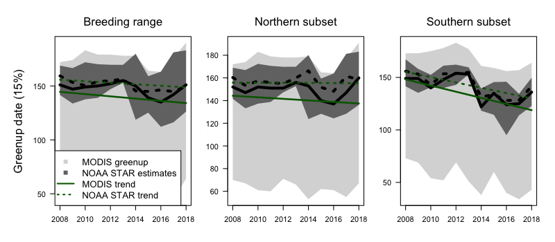

## Conklin, Lisovski & Battley 2021 - Environmental data and analysis

In Arctic-breeding shorebirds, timing of breeding closely follows the retreat of snow-cover from tundra nest sites in the spring. We compared two indices of breeding phenology (timing of
snowmelt and spring ‘green-up’), summarized separately for two regions (North, South) of the Alaska breeding range (Figure 1) of bar-tailed godwits. We did this for two temporal periods: long-term trends encompassing the entire study period (2008–2020), and a shorter term related directly to the period in which we tracked individuals with geolocators (2008–2014).

```{r breedingRange, echo=FALSE, eval=FALSE, message=FALSE, warning=FALSE}
library(sf)
library(sp)
library(rnaturalearth)
library(raster)

set.seed(200)

btg   <- st_read("data/btg_breedingAK/btg_breedingSiteAK.shp") %>% st_set_crs(4326)
# rst <- ne_download(scale = "median", type = "MSR_50M", category = 'raster', destdir = "tmp")
rst   <- stack("tmp/MSR_50M/MSR_50M.tif")


center <- st_centroid(btg)
proj   <- sprintf("+proj=laea +lon_0=%f +lat_0=%f +ellps=sphere", st_coordinates(center)[,1], st_coordinates(center)[,2])
bfr    <- st_transform(center, proj) %>% st_buffer(2500*1000) %>% st_geometry()
# map  <- ne_download(scale = 50, type = "land", category = 'physical', destdir = "tmp")
map    <- st_read("tmp/ne_50m_land.shp", quiet = TRUE) %>% st_geometry() %>% st_transform(proj) %>% 
              st_buffer(0) %>% st_intersection(bfr)

rstPr  <- mask(crop(projectRaster(rst, crs = CRS(proj)), as(bfr, "Spatial")), as(map, "Spatial"), inverse = FALSE)

png("images/Fig01_breedingRange.png", width = 500, height = 500)
  opar <- par(mar = c(0,0,0,0), bty = "n")
  plot(bfr, col = "lightsteelblue3")
  plot(rstPr, col = viridis::cividis(100), legend = FALSE, add = T)
  plot(map, add = T)
  plot(btg %>% st_transform(proj) %>% st_geometry(), col = adjustcolor("purple4", alpha.f = 0.5), add = T)
  par(opar)
dev.off()
```
<center>
  </img>
  <figcaption>Figure 1: Breeding range of Bar-tailed godwits in Alaska. Map data from Natural Earth https://www.naturalearthdata.com/. Breeding range supplied by BirdLife International and Handbook of the Birds of the World (2017) Bird species distribution maps of the world. Version 7.0. Available at http://datazone.birdlife.org/species/requestdis </figcaption>
</center>

## The Datasets

### IMS Daily Northern Hemisphere Snow and Ice Analysis

Remotely sensed IMS Daily Northern Hemisphere Snow and Ice Analysis data for the period 2008–2020 on a scale of 4 x 4 km were downloaded from the National Snow & Ice Data Center [1].

1. List all available downloaded IMS scenes (paths to files) and extract dates.

```{r snow1, eval = FALSE}
## list all downloaded IMS ASCI files
fls.gz <- list.files("~/4km", pattern = ".gz", recursive = T,  full.names = T)

## get dates for ASCI files
dates  <- as.Date(as.POSIXct(unlist(lapply(strsplit(fls.gz, "ims"), function(x) {
  strsplit(x[[2]], "_4km")}))[c(TRUE, FALSE)], format = "%Y%j"))
```   

2. Initialize the file structure (projection, raster indices)

```{r snow2, eval = FALSE}
prj <- "+proj=stere +lat_0=90 +lat_ts=60 +lon_0=-80 +k=1 +x_0=0 +y_0=0 +a=6378137 +b=6356257 +units=m +no_defs"

## read random file to initialize raster
rastID  <- sample(1:length(fls.gz), 1)
asciDat <- readLines(fls.gz[rastID])
## delete non-data
tab     <- asciDat[-which(unlist(suppressWarnings(lapply(asciDat, function(x) is.na(as.numeric(gsub(" ", "", x)))))))]
  
  z <- unlist(lapply(tab, function(.line) as.numeric(strsplit(.line, '')[[1]]))) ## snow data to vector
  m <- matrix(z, ncol = 6144, nrow = 6144, byrow = T)[6144:1,]                   ## to matrix (and flip)                         

  snowR <- raster(m, crs = CRS(prj))                                             ## to raster
  extent(snowR)      <- c(-12288000, 12288000, -12288000, 12288000)              ## define extent

## get raster indices for cells inside the breeding range  
rInd <- extract(snowR, as(btg %>% st_transform(prj), "Spatial"), cellnumbers=TRUE)[[1]][,1]
  
# png("images/Fig02_init.png", width = 2000, height = 1000)
#   opar <- par(mfrow = c(1,2), mar = c(0,0,0,0), bty = "n")
#   plot(snowR, legend = FALSE, breaks = seq(-1, 4),
#      col = c("transparent", "lightsteelblue3", "palegreen4", "grey80", "grey99"),
#      xaxt = "n", yaxt = "n")
#   plot(btg %>% st_transform(prj) %>% st_geometry(), add = T, 
#      col = adjustcolor("purple4", alpha.f = 0.5), border = NA)
# 
#   plot(btg %>% st_transform(prj) %>% st_geometry())
#   points(coordinates(snowR)[rInd,], pch = 16, cex = 0.1)
#   par(opar)
# dev.off()
```

<center>
  </img>
  <figcaption>Figure 2: Random IMS scene (green = open land, white = snow covered land, grey = ice covered ocean) in the left and breeding range polygon with center coordinates of cells that intersect with the breeding range on the right (n = 13,442 cells).</figcaption>
</center>

3. Create matrix with each pixel that intersects the breeding range in rows and for each scene in columns. Change `mclapply` to `lapply` (and delete the `mc.cores` option) on systems running windows.

```{r snow3, eval = FALSE}
snowM <- do.call("cbind", lapply(1:length(dates), function(x) {  
    
    tmp <- readLines(fls.gz[x])
    tab <- tmp[-which(unlist(suppressWarnings(parallel::mclapply(tmp, function(x) is.na(as.numeric(gsub(" ", "", x))), mc.cores = parallel::detectCores()-1))))]
    
    z <- unlist(parallel::mclapply(tab, function(.line) as.numeric(strsplit(.line, '')[[1]]), mc.cores = parallel::detectCores()-1))
    m <- matrix(z, ncol = 6144, nrow = 6144, byrow = T)[6144:1,] 
    
    raster(m)[][rInd]
    
}))
  
snowRaw <- list(crds = coordinates(snowR)[rInd,], dates = dates, snow = snowM)
# save(snowRaw, file = "results/snowRaw_4km_2004_2020.RData")
```

```{r, include=FALSE}
load("results/snowRaw_4km_2004_2020.RData")
```

4. Define (a) asymmetric gaussian model, (b) log-likelihood function and (c) function that calculates the dates for specified thresholds in the model prediction.

```{r SnowFunctions, message=FALSE, warning=FALSE}
library(bbmle)
library(zoo)

### a. assymetric gaussian model
gauss.curve <- function(parms, tab) {
  t <- 1:nrow(tab)
  parms <- as.list(parms)
  fit1 <- 1 - exp(-((parms$a1 - t[1:(which(t==floor(parms$a1)))])/parms$a4)^parms$a5)
  fit2 <- 1 - exp(-((t[which(t==floor(parms$a1)):length(t)]-parms$a1)/parms$a2)^parms$a3)
  c(fit1, fit2[-1])
}

### b. log-likelihood function with binomial error distribution.
fitGauss <- function(tab) {
  gauss.loglik <- function(a1, a2, a3, a4, a5) {
    fit <- gauss.curve(parms = list(a1=a1, a2=a2, a3=a3, a4=a4, a5=a5), tab)  
    fit <- ifelse(fit>0.999, 1-(1e-5), ifelse(fit<0.001, 1e-5, fit))
    -sum(dbinom(x = tab[,2]*100, size = rep(100, length(fit)), prob = fit, log = TRUE), na.rm=T)
  } 
  
  mle <- suppressWarnings(bbmle::mle2(gauss.loglik, method="L-BFGS-B",
                                      start=list(a1 = 200,     a2 = 40,  a3 = 9,  a4 = 40, a5 = 9),
                                      lower=list(a1 = 120,  a2 = 5,   a3 = 0.5,a4 = 5,  a5 = 0.5),
                                      upper=list(a1 = 240,  a2 = Inf,  a3 = Inf, a4 =  Inf, a5 =  Inf)
  ))
  
  coef(mle)
} 

### c. Curve intersection
curveIntersect <- function(curve1, curve2, empirical=TRUE, domain=NULL) {

  curve1_f <- approxfun(curve1$x, curve1$y, rule = 2)
  curve2_f <- approxfun(curve2$x, curve2$y, rule = 2)

  point_x <- uniroot(function(x) curve1_f(x) - curve2_f(x),
                    c(min(curve1$x), max(curve1$x)))$root

  point_y <- curve2_f(point_x)
  
  list(x = point_x, y = point_y)
} 
```

7. Fit asymmetric gaussian model and extract date of 1/3 snow (model prediction intersects falls below 66.66) free per pixel and year. In addition dates will be extracted when the pixel was snow free for the first time in each year and the first date when the pixel remained snow free for at least 60 days.

```{r snow7, eval = FALSE}
smM <- abind::abind(parallel::mclapply(1:nrow(snowRaw$crds), function(j) {

  ## only interested in snow free land vs. snow covered land (different years have different values e.g. 4 or 165 for snow free)
  y <- ifelse(snowRaw$snow[j,]%in%c(4,165), 4, ifelse(snowRaw$snow[j,]%in%c(3,164), 3, snowRaw$snow[j,]))

  if(sum(!y%in%c(2,4)) < length(y)/5) {

    tab0 <- data.frame(year = as.numeric(format(snowRaw$dates, "%Y")),
                       s    = ifelse(y%in%c(0,1), 0, ifelse(y==2, 0, 1)),
                       doy =  as.numeric(format(snowRaw$dates, "%j")))

    ## split by year
    spl <- split(tab0, f = as.character(tab0$year))

    sm1 <- do.call("rbind", lapply(spl, function(x) {
      
      tab <- merge(data.frame(day = 1:365), data.frame(day = as.numeric(x[,3]), p = as.numeric(x[,2])), all.x = T)

      mle <- fitGauss(tab)
      fit <- gauss.curve(mle, tab)

      sm <- tryCatch(curveIntersect(data.frame(x = tab[,1], y = fit)[1:mle[1],], data.frame(x = tab[,1], y = 0.666))$x,
                     error = function(x) NA)
      
      open0 <- sapply(which(tab$p<0.5), function(s) {

        if(any(!is.na(tab$p[s:nrow(tab)]) & tab$p[s:nrow(tab)]>0.5)) {
          nextSnow <- min(which(tab$p[s:nrow(tab)]>0.5))+s
        } else nextSnow <- nrow(tab)
        
        diff(c(s, nextSnow))

      })
      
      cbind(year = median(as.numeric(as.numeric(as.character(x[,1])))), sm = sm, 
            first = min(tab$day[which(tab$p<0.5)]), 
            open  = tab$day[which(tab$p<0.5)[min(which(open0>=60))]])

    }))

    array(unlist(c(merge(data.frame(year = 2004:2020), sm1, all.x = T)[,-1])), dim = c(1,length(2004:2020),3))

  } else {
    array(dim = c(1,length(2004:2020),3))
  }

}, mc.cores = parallel::detectCores()-1), along = 1)

snow <- list(crds = snowRaw$crds, smM = smM)
save(snow, file = "results/snowMelt_4km.RData")
```

```{r, include = FALSE}
load("results/snowMelt_4km.RData")
```


```{r, include = FALSE, eval = FALSE}
library(nlme)
library(lmerTest)
library(lme4)
library(merTools)
library(mgcv)
library(glue)

crds <- rgdal:::project(snow$crds, prj, inv = T)
ind  <- matrix(c(crds[,2]<90, crds[,2]>64, crds[,2]<=64), nrow = 3, byrow = TRUE)

### 2008 - 2020

snowTrend <- lapply(1:3, function(l)
  apply(snow$smM[ind[l,],which(2004:2020>=2008),l], 2, function(x) {
    quantile(x, probs = c(0.025, 0.5, 0.975), na.rm = T)
  }))

snowStats <- do.call("cbind",lapply(1:3, function(l) {
  do.call("rbind", lapply(1:3, function(t) {
      tmp <- data.frame(year = rep(2008:2020, each = sum(ind[l,])), 
                        snow = c(snow$smM[ind[l,],which(2004:2020>=2008),t]),
                        cell = rep(which(ind[l,]), length(2008:2020)))
      tmp <- subset(tmp, !is.na(snow) & !is.nan(snow) & !is.infinite(snow))
      
      lm <- lmer(snow ~ year + (1|cell), data = tmp, na.action = na.omit)
    
      nsim <- 2000
      bsim <- arm::sim(lm, n.sim = nsim)
    
      out <- c(Median = round(summary(lm)$coefficients[2,1], 3), suppressMessages(confint(lm, parm = "year")), se = sd(bsim@fixef[,2])/sqrt(length(bsim@fixef[,2])))
      if(l==1) {
        glue("{round(out[1],3)} d/yr ± SE {round(out[4],4)}; (95% Cl, {round(out[2],3)}, {round(out[3],3)})")
      } else {
                glue("{round(out[1],3)} ± {round(out[4],4)}; ({round(out[2],3)}, {round(out[3],3)})")
      }
  }))
  }))

rownames(snowStats) <- c("Gaussian fit", "First doy", "Free doy")
colnames(snowStats) <- c("Breeding area", "Northern subset", "Southern subset")


### 2008-2014

snowTrend2 <- lapply(1:3, function(l)
  apply(snow$smM[ind[l,],which(2004:2020>=2008 & 2004:2020<=2014),l], 2, function(x) {
    quantile(x, probs = c(0.025, 0.5, 0.975), na.rm = T)
  }))

snowStats2 <- do.call("cbind",lapply(1:3, function(l) {
  do.call("rbind", lapply(1:3, function(t) {
      tmp <- data.frame(year = rep(2008:2014, each = sum(ind[l,])), 
                        snow = c(snow$smM[ind[l,],which(2004:2020>=2008 & 2004:2020<=2014),t]),
                        cell = rep(which(ind[l,]), length(2008:2014)))
      tmp <- subset(tmp, !is.na(snow) & !is.nan(snow) & !is.infinite(snow))
      
      lm <- lmer(snow ~ year + (1|cell), data = tmp, na.action = na.omit)
    
      nsim <- 2000
      bsim <- arm::sim(lm, n.sim = nsim)
    
      out <- c(Median = round(summary(lm)$coefficients[2,1], 3), suppressMessages(confint(lm, parm = "year")), se = sd(bsim@fixef[,2])/sqrt(length(bsim@fixef[,2])))
      if(l==1) {
        glue("{round(out[1],3)} d/yr ± SE {round(out[4],4)}; (95% Cl, {round(out[2],3)}, {round(out[3],3)})")
      } else {
                glue("{round(out[1],3)} ± {round(out[4],4)}; ({round(out[2],3)}, {round(out[3],3)})")
      }
  }))
  }))

rownames(snowStats2) <- c("Gaussian fit", "First doy", "Free doy")
colnames(snowStats2) <- c("Breeding area", "Northern subset", "Southern subset")

statList <- list(snowStats, snowStats2)
save(statList, file = "results/snowStats.rda")

png("images/Fig03_SnowTrends.png", width = 800, height = 350, res = 100)
opar <- par(mfrow = c(1,3), mar = c(4,4,1,1), oma = c(0,3,0,0))
invisible(
  lapply(1:3, function(l) {
      range <- apply(snow$smM[ind[l,],which(2004:2020>=2008),1], 2, function(x) {
                     quantile(x, probs = c(0.025, 0.5, 0.975), na.rm = T)})
      mFirst <- apply(snow$smM[ind[l,],which(2004:2020>=2008),2], 2, median, na.rm = T)
      mFull  <- apply(snow$smM[ind[l,],which(2004:2020>=2008),3], 2, median, na.rm = T)
      plot(2008:2020,range[1,], type = "n", ylim = range(range), las = 1, xlab = "", ylab = "")
      polygon(c(2008:2020, 2020:2008), c(range[1,], rev(range[3,])), col = "grey80", border = NA)
      lines(2008:2020, range[2,], col = 1, lwd = 3)
            lines(2008:2020, mFirst, col = 1, lwd = 2, lty = 2)
                  lines(2008:2020, mFull, col = 1, lwd = 2, lty = 3)
      
      tmp <- data.frame(year = rep(2008:2020, each = sum(ind[l,])), 
                        snow = c(snow$smM[ind[l,],which(2004:2020>=2008),1]),
                        cell = rep(which(ind[l,]), length(2008:2020)))
      tmp <- subset(tmp, !is.na(snow) & !is.nan(snow) & !is.infinite(snow))
      
      lm <- lmer(snow ~ year + (1|cell), data = tmp, na.action = na.omit)
      
      newdat  <- data.frame(year = 2008:2020)
      mm      <- model.matrix(~year, newdat)

      newdat$y1 <- mm%*%fixef(lm)
      with(newdat, lines(year, y1, lty = 1, lwd = 2.5, col = "darkblue"))
      
      
      tmp <- data.frame(year = rep(2008:2014, each = sum(ind[l,])), 
                        snow = c(snow$smM[ind[l,],which(2004:2020>=2008 & 2004:2020<=2014),1]),
                        cell = rep(which(ind[l,]), length(2008:2014)))
      tmp <- subset(tmp, !is.na(snow) & !is.nan(snow) & !is.infinite(snow))
      
      lm <- lmer(snow ~ year + (1|cell), data = tmp, na.action = na.omit)
      
      newdat  <- data.frame(year = 2008:2014)
      mm      <- model.matrix(~year, newdat)

      newdat$y1 <- mm%*%fixef(lm)
      with(newdat, lines(year, y1, lty = 1, lwd = 2.5, col = "orange"))
      
      mtext(ifelse(l==1, "Breeding range", ifelse(l==2, "Northern subset", "Southern subset")), line =2, cex = 1.4)
      
      if(l==1) {
        legend("bottomleft", lty = c(1,2,3), c("Gaussian fit", "First doy", "Full doy"), cex = 1.3)
      }
  })
)
mtext("Date (doy)", 2, outer = TRUE, cex = 1.3)
par(opar)
dev.off()
```

<center>
  </img>
  <figcaption>Figure 3: Timing of snowmelt in the Alaskan breeding range and for the northern (>64 degrees North) and southern (below 64 degrees North).</figcaption>
</center>


```{r, include = FALSE}
load("results/snowStats.rda")
```

8. Trend statistics for the entire study period (2008-2020) and the tracking period (2008-2014).

```{r snowTable}
knitr::kable(statList[[1]])
knitr::kable(statList[[2]])
```


### Noise-removed NDVI from NOAA STAR

Remotely sensed NDVI data for the period 2008–2020 on a scale of 4 x 4 km were downloaded from NOAA STAR Center for Satellite Applications and Research [2]. The used noise reduced NDVI dataset is part of the blended-VHP products that is a re-processed Vegetation Health data set derived from VIIRS (2013-present) and AVHRR (1981-2012) GAC data. It was processed by the newly developed operational VHP system. The new VHP system was improved from GVI-x VH system and some changes/improvement were made to meet the requirement of operation and improve data quality. It can process GAC data from NOAA-19, as well as FRAC data from METOP A and METOP-B. It also produce vegetation health products from VIIRS on NPP and JPSS satellites. VHP system is operationaly running at NOAA Office of Satellite and Product Operations(OSPO) and providing official VHP products. This web site provides recent VH data as a backup/alternative data source. VHP product posted on this VH web site should be consistent to that released by OSPO.

1. List all available downloaded noise reduced NDVI scenes (paths to files) and extract dates.

```{r ndvi1, eval = FALSE}
## list all downloaded NDVI files
fls <- list.files("/Volumes/bioing/user/slisovsk/VHP_SM_SMN", pattern = "SMN.tif$")

strs <- sapply(strsplit(fls, ".", fixed = T), function(x) x[[5]])
year <- as.numeric(substring(strs, 2, 5))
week <- as.numeric(substring(strs, 6, 8))

date0 <- cbind(year, week)
date <-  as.POSIXct(apply(date0, 1, function(x) {
  tm <- seq(as.POSIXct(paste0(x[1], "-01-01")), as.POSIXct(paste0(x[1], "-12-31")), by = "day")
  w  <- which(x[2]==as.numeric(format(tm, "%U")))
  mean(tm[w])
}), origin = "1970-01-01")

files <- data.frame(Path = list.files(dwd, pattern = "SMN.tif$", full.names = T), Year = year, Week = week, Date = date)
files <- subset(files, Year >= 2008 & Year <= 2020)
files <- files[order(files$Date),]
```   

2. Extract values for Bar-tailed godwit breeding range in Alaska.

```{r ndvi2, eval = FALSE}
crds <- rgdal:::project(snowRaw$crds, prj, inv = T)

eviM <- do.call("cbind", pbmcapply:::pbmclapply(1:nrow(files), function(x) { 
   r0 <- raster(as.character(files[x,1]))
   raster::extract(r0, crds)
}, mc.cores = parallel::detectCores()-1))

eviRaw <- list(crds = crds, dates = files$Date, evi = eviM)
save(eviRaw, file = "results/eviRaw_4km_2008_2020.RData")
```  

```{r, include=FALSE}
load("results/eviRaw_4km_2008_2020.RData")
```

3. Snow cover and artifact correction: NDVI values below zero (artifacts) will be removed and snow cover data for each NDVI date and pixel will be extracted.

```{r ndvi3, eval = FALSE}
## closest snow value for NDVI dates
snowNDVIindex <- sapply(as.numeric(eviRaw$dates), function(d) which.min(abs(d-as.numeric(as.POSIXct(snowRaw$dates)))))

eviSnow <- abind::abind(parallel::mclapply(1:nrow(eviRaw$evi), function(x) {
  
  tmp <- ifelse(eviRaw$evi[x,]<0, NA, eviRaw$evi[x,])
  
  snow0 <- ifelse(snowRaw$snow[x,]%in%c(4,165), 4, ifelse(snowRaw$snow[x,]%in%c(3,164), 3, snowRaw$snow[x,]))
  snow  <- ifelse(snow0%in%c(0,1), 0, ifelse(snow0==2, 0, 1))

  array(c(tmp, snow[snowNDVIindex]), dim = c(1, length(tmp), 2))

}, mc.cores = parallel::detectCores()-1), along = 1)
```

4. Calculate distance matrix between cells to allow robust loess fits by including cells of the sourrounding weighted by the distance.

```{r, eval = FALSE}
### distance matrix
distM <- geosphere::distm(eviRaw$crds)
```

5. Define functions to identify peaks in time series (after Bolton et al. 2020 [3]).

```{r}
FindPeaks <- function(x, mag_order = T) {
  d <- diff(x)
  d_code <- (d > 0) + (2 * (d < 0))
  peaks <- unlist(gregexpr("12", paste(d_code, collapse="")))
  if(peaks[1] == -1) peaks <- NULL
  flat_peaks <- unlist(gregexpr("10+2", paste(d_code, collapse="")))
  if(flat_peaks[1] == -1) flat_peaks <- NULL
  d_code_rle <- rle(d_code)
  flat_peaks <- flat_peaks + round(d_code_rle$l[match(flat_peaks, cumsum(d_code_rle$l)) + 1] / 2)
  peaks <- sort(c(peaks + 1, flat_peaks + 1))
  if(mag_order) return(peaks[order(x[peaks])])
  return(peaks)
}
```

6. Smooth annual NDVI curve per pixel and extract threshold (15% of increasing curve: from snow melt to max. NDVI).

```{r, eval = FALSE}
eviPhen <- do.call("rbind", parallel::mclapply(1:nrow(eviRaw$evi), function(x) {
  
  pxlInd <- which(distM[x,]<15*1000) ## pxls in 15km sourrounding
  
  phenOut <- sapply(2008:2020, function(y) {
    
    doy <- as.numeric(format(eviRaw$dates[as.numeric(format(eviRaw$dates, "%Y"))==y], "%j"))
    tmp <- eviSnow[pxlInd,as.numeric(format(eviRaw$dates, "%Y"))==y,]
    
    snowP <- apply(tmp[,,2], 2, function(d) sum(d, na.rm = T)/length(d))

    fitTab <- data.frame(dts = rep(doy, each = dim(tmp)[1]), evi = c(tmp[,,1]), 
                         snow = rep(snowP, each = dim(tmp)[1]), weight = rep(dnorm(distM[x,pxlInd]/1000, 0, 4), dim(tmp)[2]))
        
    spl  <- with(subset(fitTab, !is.na(evi)), smooth.spline(x = dts, y = evi, spar = 0.3, w = weight))
    xSeq <- seq(min(unique(fitTab$dts[fitTab$snow<0.99])), max(unique(fitTab$dts[fitTab$snow<0.99])))
    ySeg <- predict(spl, data.frame(dts = xSeq))$y$dts
        
    max <- FindPeaks(ySeg, mag_order = F)[1]   
    amp <- diff(range(ySeg[1:max]))
    thr <- min(ySeg[1:max])+0.15*amp
    strt <- tryCatch(curveIntersect(data.frame(x = xSeq, y = ySeg)[1:max,], data.frame(x = xSeq, y = thr))$x, error = function(e) NA)
      
      # matplot(doy, t(tmp[,,1]), pch = 16, col = "grey90", type = "p", las = 1)
      # points(fitTab$dts, fitTab$evi, pch = 16, col = ifelse(fitTab$snow>0.99, "transparent", 
      #        sapply(fitTab$weight*50, function(c) adjustcolor("forestgreen", alpha.f = c))))
      # lines(xSeq, ySeg, lwd = 4, col = "orange")
      # points(strt, thr, pch = 22, cex = 2, bg = "orange", lwd = 2)
      # par(new = T)
      # plot(doy, seq(0,1, length = length(doy)), type = "n", xlab = "", ylab = "", yaxt = "n")
      # points(doy, snowP, pch = 16, col = "blue", type = "o")
    
   strt
  }) 
  
}, mc.cores = parallel::detectCores()-1))

evi <- list(crds = crds, eviM = eviPhen)
save(evi, file = "results/eviPhen_4km.RData")
```

```{r}
load("results/eviPhen_4km.RData")
```

```{r, include = FALSE, eval = FALSE}
crds <- evi$crds
ind  <- matrix(c(crds[,2]<90, crds[,2]>64, crds[,2]<=64), nrow = 3, byrow = TRUE)

### 2008 - 2020
eviStats <- do.call("cbind",lapply(1:3, function(l) {
      tmp <- data.frame(year = rep(2008:2020, each = sum(ind[l,])), 
                        evi = c(evi$eviM[ind[l,],]),
                        cell = rep(which(ind[l,]), length(2008:2020)))
      tmp <- subset(tmp, !is.na(evi) & !is.nan(evi) & !is.infinite(evi))
      
      lm <- lmer(evi ~ year + (1|cell), data = tmp, na.action = na.omit)
    
      nsim <- 2000
      bsim <- arm::sim(lm, n.sim = nsim)
    
      out <- c(Median = round(summary(lm)$coefficients[2,1], 3), suppressMessages(confint(lm, parm = "year")), se = sd(bsim@fixef[,2])/sqrt(length(bsim@fixef[,2])))
      glue("{round(out[1],3)} d/yr ± SE {round(out[4],4)}; (95% Cl, {round(out[2],3)}, {round(out[3],3)})")
  }))

rownames(eviStats) <- c("2008-2020")
colnames(eviStats) <- c("Breeding area", "Northern subset", "Southern subset")


### 2008-2014
eviStats2 <- do.call("cbind",lapply(1:3, function(l) {
      tmp <- data.frame(year = rep(2008:2014, each = sum(ind[l,])), 
                        evi = c(evi$eviM[ind[l,],which(2008:2020<=2014)]),
                        cell = rep(which(ind[l,]), length(2008:2014)))
      tmp <- subset(tmp, !is.na(evi) & !is.nan(evi) & !is.infinite(evi))
      
      lm <- lmer(evi ~ year + (1|cell), data = tmp, na.action = na.omit)
    
      nsim <- 2000
      bsim <- arm::sim(lm, n.sim = nsim)
    
      out <- c(Median = round(summary(lm)$coefficients[2,1], 3), suppressMessages(confint(lm, parm = "year")), se = sd(bsim@fixef[,2])/sqrt(length(bsim@fixef[,2])))
      glue("{round(out[1],3)} d/yr ± SE {round(out[4],4)}; (95% Cl, {round(out[2],3)}, {round(out[3],3)})")
  }))

rownames(eviStats2) <- c("2008-2014")
colnames(eviStats2) <- c("Breeding area", "Northern subset", "Southern subset")

eviStats <- rbind(eviStats, eviStats2)
save(eviStats, file = "results/eviStats.rda")

png("images/Fig04_EviTrends.png", width = 800, height = 350, res = 100)
opar <- par(mfrow = c(1,3), mar = c(4,4,1,1), oma = c(0,3,0,0))
invisible(
  lapply(1:3, function(l) {
      range <- apply(evi$eviM[ind[l,],], 2, function(x) {
                     quantile(x, probs = c(0.025, 0.5, 0.975), na.rm = T)})

      plot(2008:2020,range[1,], type = "n", ylim = range(range), las = 1, xlab = "", ylab = "")
      polygon(c(2008:2020, 2020:2008), c(range[1,], rev(range[3,])), col = "grey80", border = NA)
      lines(2008:2020, range[2,], col = 1, lwd = 3)

      tmp <- data.frame(year = rep(2008:2020, each = sum(ind[l,])), 
                        evi = c(evi$eviM[ind[l,],]),
                        cell = rep(which(ind[l,]), length(2008:2020)))
      tmp <- subset(tmp, !is.na(evi) & !is.nan(evi) & !is.infinite(evi))
      
      lm <- lmer(evi ~ year + (1|cell), data = tmp, na.action = na.omit)
      
      newdat  <- data.frame(year = 2008:2020)
      mm      <- model.matrix(~year, newdat)

      newdat$y1 <- mm%*%fixef(lm)
      with(newdat, lines(year, y1, lty = 1, lwd = 2.5, col = "darkgreen"))
      
      
      
      tmp <- data.frame(year = rep(2008:2014, each = sum(ind[l,])), 
                        evi = c(evi$eviM[ind[l,],which(2008:2020<=2014)]),
                        cell = rep(which(ind[l,]), length(2008:2014)))
      tmp <- subset(tmp, !is.na(evi) & !is.nan(evi) & !is.infinite(evi))
      
      lm <- lmer(evi ~ year + (1|cell), data = tmp, na.action = na.omit)
      
      newdat  <- data.frame(year = 2008:2014)
      mm      <- model.matrix(~year, newdat)

      newdat$y1 <- mm%*%fixef(lm)
      with(newdat, lines(year, y1, lty = 1, lwd = 2.5, col = "orange"))
      
      mtext(ifelse(l==1, "Breeding range", ifelse(l==2, "Northern subset", "Southern subset")), line =2, cex = 1.4)
      
  })
)
mtext("Date (doy)", 2, outer = TRUE, cex = 1.3)
par(opar)
dev.off()
```

<center>
  </img>
  <figcaption>Figure 3: Timing of vegetation greenup in the Alaskan breeding range and for the northern (>64 degrees North) and southern (below 64 degrees North).</figcaption>
</center>


```{r, include = FALSE}
load("results/eviStats.rda")
```

7. Trend statistics for the entire study period (2008-2020) and the tracking period (2008-2014).

```{r eviTable}
knitr::kable(eviStats)
```

### MODIS MCD12Q2 Land Cover Dynamic greenup trends (2008-2018) in comparison with above calculated greenup trend.

1. Get MODIS MCD12Q2 Land Cover Dynamic Greenup days for the years 2008 to 2018 (and pixel quality estimate).

```{r modis1, eval = FALSE}
library(rgee)
ee_Initialize()

roi_ee <- ee$Geometry$Rectangle(
  coords = st_bbox(st_read("data/btg_breedingAK/btg_breedingSiteAK.shp") %>% 
                     st_set_crs(4326) %>% st_geometry()),
  proj = "EPSG:4326",
  geodesic = FALSE
)

for(y in 2008:2018) {
  
MODgup = ee$ImageCollection('MODIS/006/MCD12Q2')$
  filter(ee$Filter$date(glue::glue('{y}-01-01'), glue::glue('{y}-12-31')))$
  select(c("Greenup_1", "QA_Overall_1"))

rOut <- ee_as_raster(
  image = MODgup$median(),
  region = roi_ee,
  scale  = 500,
  via = "getInfo",
  quiet = TRUE
)

rOut <- mask(rOut, as(btg, "Spatial"))

if(y==2008) {
  MOD12gup <- matrix(ifelse(rOut[][,2]<=1 & rOut[][,1]>=0, 
                      as.numeric(format(as.POSIXct(rOut[][,1]*24*60*60, origin = "1970-01-01"), "%j")), NA), ncol = 1)
} else {
  MOD12gup <- cbind(MOD12gup, ifelse(rOut[][,2]<=1 & rOut[][,1]>=0, 
                      as.numeric(format(as.POSIXct(rOut[][,1]*24*60*60, origin = "1970-01-01"), "%j")), NA))
}

}


MODgup  <- list(crds = coordinates(rOut), mod = MOD12gup)
save(MODgup, file = "results/MODgup.rda")
```

2. Trend statistics and comparison.

```{r modis2, eval = FALSE, include = FALSE}
crdsSTAR <- evi$crds
indSTAR  <- matrix(c(crdsSTAR[,2]<90, crdsSTAR[,2]>64, crdsSTAR[,2]<=64), nrow = 3, byrow = TRUE)

crdsMOD  <- MODgup$crds
indMOD  <- matrix(c(crdsMOD[,2]<90, crdsMOD[,2]>64, crdsMOD[,2]<=64), nrow = 3, byrow = TRUE)


png("images/Fig05_MOD_STARcomp.png", width = 800, height = 350, res = 100)
opar <- par(mar = c(3,3,1,1), mfrow = c(1,3), oma = c(1,3,3,1), las = 1)

for(l in 1:3) {
  
  rngMOD  <- apply(MODgup$mod[indMOD[l,],], 2, function(x) quantile(x[x>10], probs = c(0.025, 0.5, 0.975), na.rm = T))
  rngSTAR <- apply(evi$eviM[indSTAR[l,],which(2008:2020<=2018)], 2, function(x) quantile(x, probs = c(0.025, 0.5, 0.975), na.rm = T))
  
  plot(2008:2018, rngMOD[2,], type = "n", ylim = range(rngMOD))
  polygon(c(2008:2018, 2018:2008), c(rngMOD[1,], rev(rngMOD[3,])), col = "grey85", border = NA)
  polygon(c(2008:2018, 2018:2008), c(rngSTAR[1,], rev(rngSTAR[3,])), col = "grey45", border = NA)
  lines(2008:2018, rngMOD[2,], lwd = 4)
  lines(2008:2018, rngSTAR[2,], lwd = 4, lty = 3)
  
  
  ## MOD trendline
  tmp <- data.frame(year = rep(2008:2018, each = sum(indMOD[l,])), 
                    gup  = c(MODgup$mod[indMOD[l,],]),
                    cell = rep(which(indMOD[l,]), length(2008:2018)))
      
  tmp <- subset(tmp, !is.na(gup) & !is.nan(gup) & !is.infinite(gup) & gup > 1)
      
  lm <- lmer(gup ~ year + (1|cell), data = tmp[sample(1:nrow(tmp), 15000),], na.action = na.omit)
  
  newdat  <- data.frame(year = 2008:2018)
  mm      <- model.matrix(~year, newdat)

  newdat$y1 <- mm%*%fixef(lm)
  with(newdat, lines(year, y1, lty = 1, lwd = 2.5, col = "darkgreen"))
 
  outMod <- c(Median = round(summary(lm)$coefficients[2,1], 3), suppressMessages(confint(lm, parm = "year")), se = sd(bsim@fixef[,2])/sqrt(length(bsim@fixef[,2])))
  tbMod  <- glue("{round(outMod[1],3)} d/yr ± SE {round(outMod[4],4)}; (95% Cl, {round(outMod[2],3)}, {round(outMod[3],3)})")   
  
  
  ## STAR trendline
  tmp <- data.frame(year = rep(2008:2018, each = sum(indSTAR[l,])), 
                    gup  = c(evi$eviM[indSTAR[l,],which(2008:2020<=2018)]),
                    cell = rep(which(indSTAR[l,]), length(2008:2018)))
      
  tmp <- subset(tmp, !is.na(gup) & !is.nan(gup) & !is.infinite(gup) & gup > 1)
      
  lm <- lmer(gup ~ year + (1|cell), data = tmp, na.action = na.omit)
  
  newdat  <- data.frame(year = 2008:2018)
  mm      <- model.matrix(~year, newdat)

  newdat$y1 <- mm%*%fixef(lm)
  with(newdat, lines(year, y1, lty = 3, lwd = 2.5, col = "darkgreen"))
 
  if(l==1) {
    legend("bottomleft", pch = c(15, 15, NA, NA), lty = c(NA, NA, 1,3), c("MODIS greenup", "NOAA STAR estimates", "MODIS trend", "NOAA STAR trend"), cex = 1.2,
           col = c("grey85", "grey45", "darkgreen", "darkgreen"), lwd = 2)
    mtext("Greenup date (15%)", 2, line = 3.4, las = 3)
  }
  mtext(c("Breeding range", "Northern subset", "Southern subset")[l], 3, line = 1)
  
  
  outSTAR <- c(Median = round(summary(lm)$coefficients[2,1], 3), suppressMessages(confint(lm, parm = "year")), se = sd(bsim@fixef[,2])/sqrt(length(bsim@fixef[,2])))
  tbSTAR  <- glue("{round(outSTAR[1],3)} d/yr ± SE {round(outSTAR[4],4)}; (95% Cl, {round(outSTAR[2],3)}, {round(outSTAR[3],3)})") 
  
  statsOut <- rbind(tbMod, tbSTAR)
  if(l==1) {
    statsTab <- statsOut
  } else {
    statsTab <- cbind(statsTab, statsOut)
  }
  
}

par(opar)
dev.off()

colnames(statsTab) <- c("Breeding area", "Northern subset", "Southern subset")
save(statsTab, file = "results/statsTab.rda")
```

```{r, include  = FALSE}
load("results/statsTab.rda")
```

<center>
  </img>
  <figcaption>Figure 5: Comparison of trends in MODIS MCD12Q2 Greenup and NOAA STAR greenup estimates.</figcaption>
</center>


```{r MODSTARTable}
knitr::kable(statsTab)
```


### References

[1] IMS Daily Northern Hemisphere Snow and Ice Analysis at 1 km, 4 km, and 24 km Resolutions, Version 1. https://doi.org/10.7265/N52R3PMC

[2] https://www.star.nesdis.noaa.gov/smcd/emb/vci/VH/vh_ftp.php

[3] Douglas K. Bolton, Josh M. Gray, Eli K. Melaas, Minkyu Moon, Lars Eklundh, Mark A. Friedl (2020) Continental-scale land surface phenology from harmonized Landsat 8 and Sentinel-2 imagery. Remote Sensing of Environment, 240, https://doi.org/10.1016/j.rse.2020.111685.

